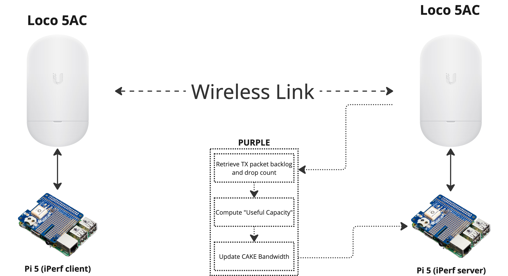

# PURPLE: Dynamic Control of CAKE

PURPLE is an algorithm designed to estimate "useful capacity" and control bufferbloat in wireless networks through dynamic adjustment of CAKE's bandwidth parameter. The algorithm draws inspiration from the BLUE active queue management scheme, itself being an evolution of RED, adapting its congestion detection mechanisms for wireless capacity estimation.

## Background

Bufferbloat, or excessive queuing delay under load, is a noticeable quality of service degradation that occurs when latency-sensitive traffic experiences the effects of increased packet buffering delays in network devices. This phenomenon leads to increased latency and reduced network performance, particularly affecting real-time applications.

While FQ-CoDel and CAKE are existing AQM solutions that help mitigate bufferbloat, they require properly configured bandwidth settings. In wireless networks where capacity can be highly variable, static bandwidth settings are insufficient. PURPLE addresses this by dynamically adjusting CAKE's bandwidth parameter based on real-time network conditions.

## How PURPLE Works

PURPLE consists of two main components:

1. Queue state monitoring
2. Capacity adjustment based on congestion signals

### Queue State Monitoring

PURPLE maintains a marking probability that reflects the congestion state:

```math
p_m(t + \Delta t) = 
\begin{cases}
\min(1, p_m(t) + \delta_i) & \text{if } q_b > 0 \text{ or } \Delta q_d \geq \theta_d \text{ and } t - t_{last} \geq t_f \\
\max(0, p_m(t) - \delta_d) & \text{if } q_b = 0 \text{ and } \Delta q_d < \theta_d \text{ and } t - t_{last} \geq t_{df} \\
p_m(t) & \text{otherwise}
\end{cases}
```

where:
- $q_b$ is the current queue backlog
- $\Delta q_d$ is the change in packet drops since last measurement
- $\theta_d$ is the drop threshold
- $\delta_i$ is the increment step
- $\delta_d$ is the decrement step
- $t_f$ is the freeze time for increments
- $t_{df}$ is the freeze time for decrements
- $t_{last}$ is the time of last probability update

### Adaptive Capacity Management

PURPLE uses the marking probability to estimate the useful capacity:

```python
if in_congestion:
    reduction = p_m × 0.5
    C_target = r_p50 × (1 - reduction)
    C_target = max(C_target, r_tx × α_min)  # Handle rate divergence
else:
    if C_useful is empty:  # Initial state
        C_target = C_p50 × β_safety
    else:
        headroom = max(0, (C_p50 × β_safety) - C_useful)
        if headroom = 0:  # Capacity dropping
            C_target = C_p50 × β_safety
        else:
            C_target = C_useful + (headroom × α_recovery)

# Apply smoothing
if in_congestion or C_target > C_useful:
    C_target = α × C_target + (1-α) × C_useful

C_useful = C_target
```

where:
- $C_{useful}$ is the estimated useful capacity
- $C_{p50}$ is the median of radio's reported capacity
- $r_{p50}$ is the median of transmission rate
- $p_{enter}$ and $p_{exit}$ are congestion entry/exit thresholds
- $\alpha_{min}$ is the minimum decrease factor
- $\alpha_{recovery}$ is the recovery rate factor
- $\alpha$ is the smoothing factor
- $\beta_{safety}$ is the safety margin factor

## Network State Classification

PURPLE classifies the network state based on the marking probability:

```math
\text{State} = 
\begin{cases}
\text{SEVERE\_CONGESTION} & \text{if } p_m > 0.8 \\
\text{MILD\_CONGESTION} & \text{if } p_m > 0.3 \\
\text{STABLE} & \text{otherwise}
\end{cases}
```

## PURPLE ESC Approach

PURPLE can also be implemented using an Extremum Seeking Control (ESC) approach. This approach continuously probes the system using a perturbation signal to find the optimal capacity estimate.

### ESC Formulation

With ESC, we define a multi-objective function to maximise:

```math
J(t) = -Q_c(\hat{C}(t) - \gamma C(t))^2 + Q_r\frac{r(t)}{\hat{C}(t)} - Q_b\phi(b(t)) - Q_d\psi(\dot{d}(t))
```

where:
- $\gamma$ is the safety margin (typically 0.85)
- $Q_c$, $Q_r$, $Q_b$, $Q_d$ are weighting factors
- $\phi(b)$ is the backlog penalty function
- $\psi(\dot{d})$ is the drop rate penalty function

The capacity estimate is updated using:

```math
\hat{C}(t + \Delta t) = (1-\alpha)\hat{C}(t) + \alpha(\gamma C(t) + k(t)g(t))
```

where:
- $\alpha$ is the learning rate
- $k(t)$ is the adaptive gain
- $g(t) = J(t)p(t)$ is the gradient estimate
- $p(t) = a\sin(\omega t)$ is the perturbation signal

## Comparison with BLUE

| Aspect | Original BLUE | PURPLE |
|--------|---------------|--------|
| Event Triggers | Queue overflow events for increment; empty queue events for decrement | Backlog or packet drops for increment; zero backlog and no drops for decrement |
| State Variable | Single marking probability used to mark/drop packets | Single marking probability used to estimate effective capacity |
| Response Mechanism | Direct packet marking or dropping at queue ingress | Adjustment of estimated useful capacity based on marking probability |
| Increment Events | Only on queue overflow (severe congestion) | On any backlog or drops (potentially more sensitive) |
| Update Frequency | Limited by freeze time between probability updates | Limited by freeze time with smoothing factor for capacity changes |
| Application | Active queue management for congestion control | Capacity estimation for wireless links |

## Key Assumptions

PURPLE makes some assumptions about wireless network design:

1. The top ~15% of the reported radio capacity is not useful due to excessive queuing delays
2. We want to avoid setting an ultra-conservative "safe rate"
3. Even with conservative settings, unexpected interference can invalidate static configurations

By dynamically adjusting CAKE's bandwidth parameter based on real-time network conditions, PURPLE enables more effective control over bufferbloat in wireless networks where capacity can vary significantly, and without any warning.

## Solution Architecture

PURPLE has been implemented and tested in a controlled wireless testbed environment, as illustrated below:



### Testbed Components

The testbed consists of:

1. **Wireless Link**: Two Ubiquiti Loco 5AC devices establish a point-to-point wireless link, creating a "real" wireless environment with variable capacity affected by external factors like interference and path loss.

2. **Traffic Generation**: Two Raspberry Pi 5 computers run iPerf2 to generate controlled network traffic:
   - One Pi acts as the iPerf client (traffic generator)
   - The other Pi serves as the iPerf server (traffic receiver)

3. **PURPLE Controller**: The monitoring and control system that:
   - Retrieves real-time data from the wireless link (TX packet backlog and drop count)
   - Processes this information to compute the "Useful Capacity" 
   - Dynamically updates the CAKE bandwidth parameter on the traffic-generating side

### Operational Flow

1. The PURPLE controller continuously monitors the packet backlog and drop count from the wireless interface
2. When congestion is detected (increasing backlog or drops), PURPLE calculates a new estimate of what the "useful capacity" should be
3. This estimate is used to update CAKE's bandwidth parameter, which controls traffic shaping
4. As conditions change, PURPLE continues to adapt, preventing bufferbloat while maximising available throughput

## Next Steps

While our current testbed provides valuable insights into PURPLE's performance in real-world conditions, we plan to upgrade our experimental setup to enable more consistent, controlled, and repeatable experiments.

### Enhanced Testbed with Electronic Attenuation Control

The next evolution of our testing environment will incorporate electronically controllable RF attenuators to precisely manipulate signal strength between wireless devices. This will allow us to:

1. **Create Reproducible Scenarios**: Generate consistent and repeatable patterns of signal degradation and interference
2. **Test Edge Cases**: Simulate rapid capacity variations that might be rare in natural environments but critical for algorithm validation
3. **Quantify Performance Boundaries**: Systematically determine the limits of PURPLE's adaptation capabilities

### Proposed Implementation

The enhanced testbed will include:

- **Programmable RF Attenuators**: Digital Step Attenuators (DSAs) with precise dB-level control
- **Automation Framework**: Software to orchestrate attenuation patterns simulating various real-world scenarios:
  - Gradual signal fading (e.g., weather effects)
  - Sudden interference (e.g., competing transmitters)
  - Oscillating conditions (e.g., moving obstacles)
- **Synchronised Measurements**: Correlation between attenuation events, measured capacity, and PURPLE's responses

### Additional Improvements

Beyond controlled attenuation, we also plan to:

1. Extend testing to more complex network topologies with multiple wireless hops
2. Fine-tune PURPLE's parameters based on controlled experiments and formal stability analysis
3. Benchmark against other dynamic bandwidth estimation approaches
4. Test interoperability with complementary technologies like Multipath TCP (does PURPLE affect normal operation?)

Building this laboratory-grade testbed will help us evaluate PURPLE's effectiveness across a wide range of wireless conditions, and provide stronger evidence of its benefits for real-world deployments in challenging rural environments.