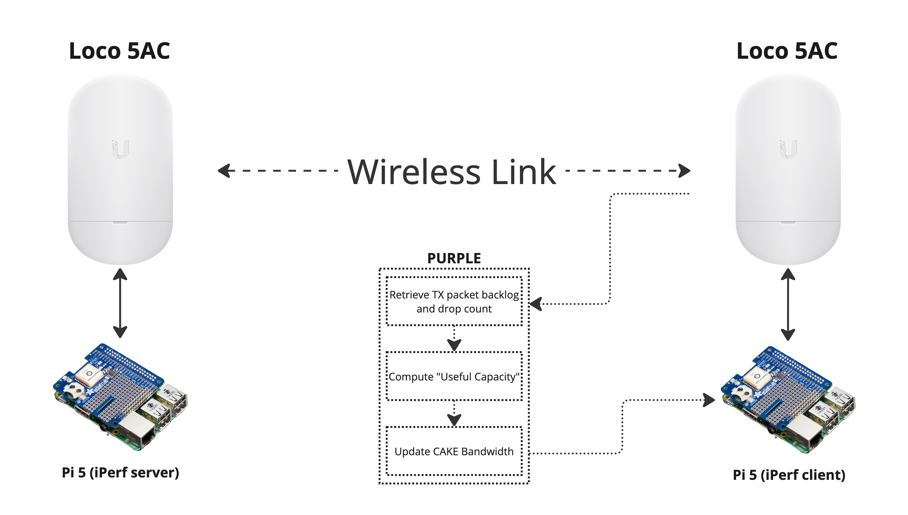

# PURPLE: Dynamic Control of CAKE

PURPLE is an algorithm designed to estimate "useful capacity" and control bufferbloat in wireless networks through dynamic adjustment of CAKE's bandwidth parameter. The algorithm draws inspiration from the BLUE active queue management scheme, itself being an evolution of RED, adapting its congestion detection mechanisms for wireless capacity estimation.

## Background

Bufferbloat, or excessive queuing delay under load, is a noticeable quality of service degradation that occurs when latency-sensitive traffic experiences the effects of increased packet buffering delays in network devices. This phenomenon leads to increased latency and reduced network performance, particularly affecting real-time applications.

While FQ-CoDel and CAKE are existing AQM solutions that help mitigate bufferbloat, they require properly configured bandwidth settings. In wireless networks where capacity can be highly variable, static bandwidth settings are insufficient. PURPLE addresses this by dynamically adjusting CAKE's bandwidth parameter based on real-time network conditions.

## How PURPLE Works

PURPLE consists of two main components:

1. Queue state monitoring
2. Capacity adjustment based on congestion signals

### Queue State Monitoring

PURPLE maintains a marking probability that reflects the congestion state:

```math
p_m(t + \Delta t) = 
\begin{cases}
\min(1, p_m(t) + \delta_i) & \text{if } q_b > 0 \text{ or } \Delta q_d \geq \theta_d \text{ and } t - t_{last} \geq t_f \\
\max(0, p_m(t) - \delta_d) & \text{if } q_b = 0 \text{ and } \Delta q_d < \theta_d \text{ and } t - t_{last} \geq t_{df} \\
p_m(t) & \text{otherwise}
\end{cases}
```

where:
- $q_b$ is the current queue backlog
- $\Delta q_d$ is the change in packet drops since last measurement
- $\theta_d$ is the drop threshold
- $\delta_i$ is the increment step
- $\delta_d$ is the decrement step
- $t_f$ is the freeze time for increments
- $t_{df}$ is the freeze time for decrements
- $t_{last}$ is the time of last probability update

### Adaptive Capacity Management

PURPLE uses the marking probability to estimate the useful capacity:

```python
if in_congestion:
    reduction = p_m × 0.5
    C_target = r_p50 × (1 - reduction)
    C_target = max(C_target, r_tx × α_min)  # Handle rate divergence
else:
    if C_useful is empty:  # Initial state
        C_target = C_p50 × β_safety
    else:
        headroom = max(0, (C_p50 × β_safety) - C_useful)
        if headroom = 0:  # Capacity dropping
            C_target = C_p50 × β_safety
        else:
            C_target = C_useful + (headroom × α_recovery)

# Apply smoothing
if in_congestion or C_target > C_useful:
    C_target = α × C_target + (1-α) × C_useful

C_useful = C_target
```

where:
- $C_{useful}$ is the estimated useful capacity
- $C_{p50}$ is the median of radio's reported capacity
- $r_{p50}$ is the median of transmission rate
- $p_{enter}$ and $p_{exit}$ are congestion entry/exit thresholds
- $\alpha_{min}$ is the minimum decrease factor
- $\alpha_{recovery}$ is the recovery rate factor
- $\alpha$ is the smoothing factor
- $\beta_{safety}$ is the safety margin factor

## Network State Classification

PURPLE classifies the network state based on the marking probability:

```math
\text{State} = 
\begin{cases}
\text{SEVERE\_CONGESTION} & \text{if } p_m > 0.8 \\
\text{MILD\_CONGESTION} & \text{if } p_m > 0.3 \\
\text{STABLE} & \text{otherwise}
\end{cases}
```

## PURPLE-AIMD: Latency-Based Dynamic Bandwidth Control

PURPLE-AIMD is a simplified approach to the regular PURPLE algorithm. The responsiveness of regular PURPLE depends on the polling frequency of target radio queue metrics, which might not always be available for all vendors. Furthermore, these metrics are difficult to obtain in real-time. Utilities such as traffic control (tc) on Linux suffice, but poll-mode operation is not ideal, and PURPLE would ideally be implemented at the qdisc level, a desire that is not viable for the millions of legacy radios that experience bufferbloat.

PURPLE-AIMD offers further improvements to responsiveness by using unidirectional latency measurements as the sole input signal for CAKE bandwidth parameter control. A target latency is set (e.g., 5 milliseconds) and the Additive Increase Multiplicative Decrease (AIMD) algorithm. Resultantly, PURPLE-AIMD is platform agnostic and able to operate in environments where low-level queue metrics are not available.

### Mathematical Formulation

PURPLE-AIMD maintains a bandwidth rate $C(t)$ that is updated based on latency measurements. The rate adaptation follows the classic AIMD paradigm, which has good stability properties, and has held the Internet together (as the primary TCP control algorithm) for many decades now.

For each control interval at time $t$, the rate is updated as follows:

```math
C(t + \Delta t) = \begin{cases}
C(t) \cdot (1 - \beta_d) & \text{if } \ell(t) \geq \ell_{critical} \\
C(t) \cdot (1 - \beta_d/2) & \text{if } \ell_{target} + \delta_\ell < \ell(t) < \ell_{critical} \\
C(t) + \alpha_r \cdot \Delta t & \text{if } \ell(t) \leq \ell_{target} + \delta_\ell \text{ and recovery = true} \\
C(t) & \text{otherwise}
\end{cases}
```

where:
- $\ell(t)$ is the current latency measurement
- $\ell_{target}$ is the target latency (default 15 ms)
- $\ell_{critical}$ is the critical latency threshold (default 30 ms)
- $\delta_\ell$ is the latency tolerance (default 2 ms)
- $\beta_d$ is the decay factor for multiplicative decrease (default 0.1)
- $\alpha_r$ is the recovery rate for additive increase (default 0.5 Mbps)
- $\Delta t$ is the time elapsed since the last update

The rate is further constrained by minimum and maximum limits:

```math
C(t) = \max(C_{min}, \min(C_{max}, C(t)))
```

### Recovery Phase

PURPLE-AIMD maintains a counter for consecutive "good" latency measurements:

```math
g(t) = \begin{cases}
g(t-1) + 1 & \text{if } \ell(t) \leq \ell_{target} + \delta_\ell \\
0 & \text{otherwise}
\end{cases}
```

It enters the recovery phase when this counter exceeds a threshold:

```math
\text{recovery} = \begin{cases}
\text{true} & \text{if } g(t) \geq g_{threshold} \\
\text{false} & \text{if } \ell(t) \geq \ell_{critical} \text{ or } \ell(t) > \ell_{target} + \delta_\ell
\end{cases}
```

where $g_{threshold}$ is the "good" latency threshold (default 5).

<!-- Implementation is a work in progress -->
<!-- ### Latency Trend Analysis

PURPLE-AIMD determines a trend in latency values to anticipate change:

```math
\tau(t) = \frac{n\sum_{i=0}^{n-1} i \cdot \ell_{t-i} - \sum_{i=0}^{n-1} i \cdot \sum_{i=0}^{n-1} \ell_{t-i}}{n\sum_{i=0}^{n-1} i^2 - (\sum_{i=0}^{n-1} i)^2}
```

where:
- $\ell_{t-i}$ is the latency measured $i$ intervals ago
- $n$ is the trend window size (default 5)

This represents the slope of the linear regression of recent latency values. -->

### Network State Classification

Similar to regular PURPLE, PURPLE-AIMD determines a state for the network via the unidirectional latency measurements:

```math
\text{State} = \begin{cases}
\text{CRITICAL} & \text{if } \ell(t) \geq \ell_{critical} \\
\text{HIGH} & \text{if } \ell_{target} + \delta_\ell < \ell(t) < \ell_{critical} \\
\text{RECOVERY} & \text{if } \ell(t) \leq \ell_{target} + \delta_\ell \text{ and recovery = true} \\
\text{NORMAL} & \text{otherwise}
\end{cases}
```

### PURPLE-AIMD Algorithm

```
PURPLE-AIMD Controller:
  Initialise: C ← C_initial, g ← 0, recovery ← false, t_last ← 0

  Procedure Update(ℓ, t_current):
    Δt ← t_current - t_last
    t_last ← t_current
    
    <!-- τ ← CalculateLatencyTrend(ℓ) -->
    
    if ℓ ≤ ℓ_target + δ_ℓ then
      g ← g + 1
    else
      g ← 0
    end if
    
    if g ≥ g_threshold then
      recovery ← true
    end if
    
    if ℓ ≥ ℓ_critical then
      recovery ← false
      g ← 0
      C ← C · (1 - β_d)
    else if ℓ > ℓ_target + δ_ℓ then
      recovery ← false
      C ← C · (1 - β_d/2)
    else if recovery then
      C ← C + α_r · Δt
    end if
    
    C ← max(C_min, min(C_max, C))
    return C, ℓ_target
```

### Practical Advantages of PURPLE-AIMD

Unlike the original PURPLE algorithm which required access to internal queue metrics, PURPLE-AIMD works as an equipment-agnostic solution, using only latency measurements (ICMP RTT or ideally unidirectional latency) as the control input. This means it can adapt to highly-variable dynamic wireless networks without requiring vendor-specific integrations or implementation.

In practice, PURPLE-AIMD should offer a more consistent user experience, as latency can be measured faster than queue build-up when we are constrained to poll-mode implementation of regular PURPLE, as opposed to a qdisc-level alternative. Furthermore, the platform agnosticism allows deployment across heterogeneous networks, assuming we have control of the device sending data immediately behind the bottleneck link.

However, this design assumes that high latency is indicative of congestion and requires a target latency to be set. In practice, this target latency might be derived through the network operator's intuition of a particular wireless link. It also assumes that repeated low-latency measurements indicate available capacity. The recovery rate should not be excessive to avoid oscillation in the available bandwidth (via adjustment of the CAKE bandwidth parameter).

<!-- Update needed for PURPLE-AIMD... -->
## Comparison with BLUE

| Aspect | Original BLUE | PURPLE |
|--------|---------------|--------|
| Event Triggers | Queue overflow events for increment; empty queue events for decrement | Backlog or packet drops for increment; zero backlog and no drops for decrement |
| State Variable | Single marking probability used to mark/drop packets | Single marking probability used to estimate effective capacity |
| Response Mechanism | Direct packet marking or dropping at queue ingress | Adjustment of estimated useful capacity based on marking probability |
| Increment Events | Only on queue overflow (severe congestion) | On any backlog or drops (potentially more sensitive) |
| Update Frequency | Limited by freeze time between probability updates | Limited by freeze time with smoothing factor for capacity changes |
| Application | Active queue management for congestion control | Capacity estimation for wireless links, control of CAKE's bandwidth parameter |

## Key Assumptions

PURPLE makes some assumptions about wireless network design:

1. The top ~15% of the reported radio capacity is not useful due to excessive queuing delays
2. We want to avoid setting an ultra-conservative "safe rate"
3. Even with conservative settings, unexpected interference can invalidate static configurations

By dynamically adjusting CAKE's bandwidth parameter based on real-time network conditions, PURPLE enables more effective control over bufferbloat in wireless networks where capacity can vary significantly, and without any warning.

## Solution Architecture

PURPLE has been implemented and tested in a controlled wireless testbed environment, as illustrated below:



### Testbed Components

The testbed consists of:

1. **Wireless Link**: Two Ubiquiti Loco 5AC devices establish a point-to-point wireless link, creating a "real" wireless environment with variable capacity affected by external factors like interference and path loss.

2. **Traffic Generation**: Two Raspberry Pi 5 computers run iPerf2 to generate controlled network traffic:
   - One Pi acts as the iPerf client (traffic generator)
   - The other Pi serves as the iPerf server (traffic receiver)

3. **PURPLE Controller**: The monitoring and control system that:
   - Retrieves real-time data from the wireless link (TX packet backlog and drop count)
   - Processes this information to compute the "Useful Capacity" 
   - Dynamically updates the CAKE bandwidth parameter on the traffic-generating side

### Operational Flow

1. The PURPLE controller continuously monitors the packet backlog and drop count from the wireless interface
2. When congestion is detected (increasing backlog or drops), PURPLE calculates a new estimate of what the "useful capacity" should be
3. This estimate is used to update CAKE's bandwidth parameter, which controls traffic shaping
4. As conditions change, PURPLE continues to adapt, preventing bufferbloat while maximising available throughput


## Results

The proof of concept implementation of PURPLE has been tested to evaluate its effectiveness in mitigating bufferbloat. The following results demonstrate PURPLE's performance compared to traditional CAKE configured with an optimistic 150 Mbps bandwidth parameter, and a very conservative 100 Mbps bandwidth parameter. During normal operation, the link can sustain 110-130 Mbps of TCP throughput, higher than the conservative tests we performed.

### Performance Comparison


The Cumulative Distribution Function (CDF) comparison shows the distribution of Round-Trip Time (RTT) measurements across different configurations. PURPLE consistently maintains lower latency compared to the static "optimistic" CAKE and default FQ-CoDel configuration.


The Probability Density Function (PDF) visualisation demonstrates the probability distribution of RTT measurements. PURPLE's distribution shows a tighter clustering around lower latency values, demonstrating more consistent network performance compared to the optimistic and default alternatives.


The boxplot comparison provides a clear visualisation of latency statistics across different configurations. Key observations:

- PURPLE achieves lower median latency compared to optimistic CAKE and default FQ-CoDel configurations
- The interquartile range (IQR) is significantly smaller with PURPLE
- PURPLE shows fewer extreme latency spikes that are characteristic of bufferbloat

### Key Findings

These results demonstrate that PURPLE effectively mitigates bufferbloat while improving throughput when compared to the conservative alternative configuration, even with reasonably optimistic safety margins. Specifically:

1. PURPLE dynamically adjusts to changing wireless conditions, preventing excessive queuing delays
2. The algorithm maintains stable performance across varying network loads
3. PURPLE finds an effective balance between throughput and latency, only sacraficing a small amount as the safety margin

These findings confirm that dynamic bandwidth estimation and control through PURPLE offers significant advantages over optimistic configurations, particularly where capacity can vary unpredictably. PURPLE can also increase throughput when compared to conservative approaches that sacrafice too much bandwidth to prevent bufferbloat.

## Next Steps

While our current testbed provides valuable insights into PURPLE's performance in real-world conditions, we plan to upgrade our experimental setup to enable more consistent, controlled, and repeatable experiments. We would also like to investigate creating a dynamic safety margin, that can adapt to hardware that lacks accurate rate estimation.

### Enhanced Testbed with Electronic Attenuation Control

The next evolution of our testing environment will incorporate electronically controllable RF attenuators to precisely manipulate signal strength between wireless devices. This will allow us to:

1. **Create Reproducible Scenarios**: Generate consistent and repeatable patterns of signal degradation and interference
2. **Test Edge Cases**: Simulate rapid capacity variations that might be rare in natural environments but critical for algorithm validation
3. **Quantify Performance Boundaries**: Systematically determine the limits of PURPLE's adaptation capabilities

### Proposed Implementation

The enhanced testbed will include:

- **Programmable RF Attenuators**: Digital Step Attenuators (DSAs) with precise dB-level control
- **Automation Framework**: Software to orchestrate attenuation patterns simulating various real-world scenarios:
  - Gradual signal fading (e.g., weather effects)
  - Sudden interference (e.g., competing transmitters)
  - Oscillating conditions (e.g., moving obstacles)
- **Synchronised Measurements**: Correlation between attenuation events, measured capacity, and PURPLE's responses

### Additional Improvements

Beyond controlled attenuation, we also plan to:

1. Extend testing to more complex network topologies with multiple wireless hops
2. Fine-tune PURPLE's parameters based on controlled experiments and formal stability analysis
3. Benchmark against other dynamic bandwidth estimation approaches
4. Test interoperability with complementary technologies like Multipath TCP (does PURPLE affect normal operation?)

Building this laboratory-grade testbed will help us evaluate PURPLE's effectiveness across a wide range of wireless conditions, and provide stronger evidence of its benefits for real-world deployments in challenging rural environments.